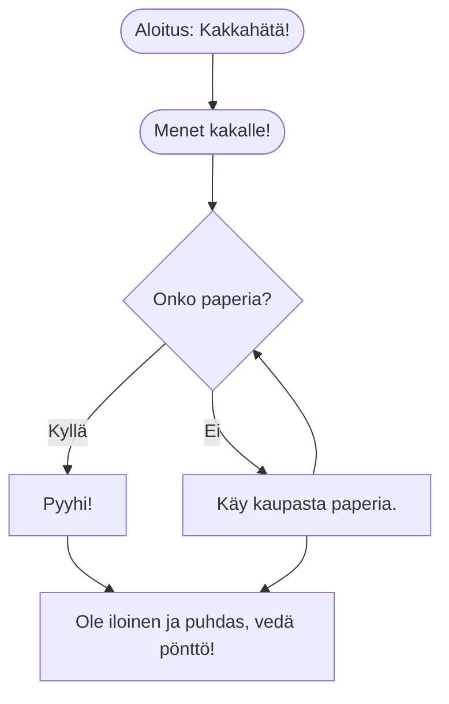
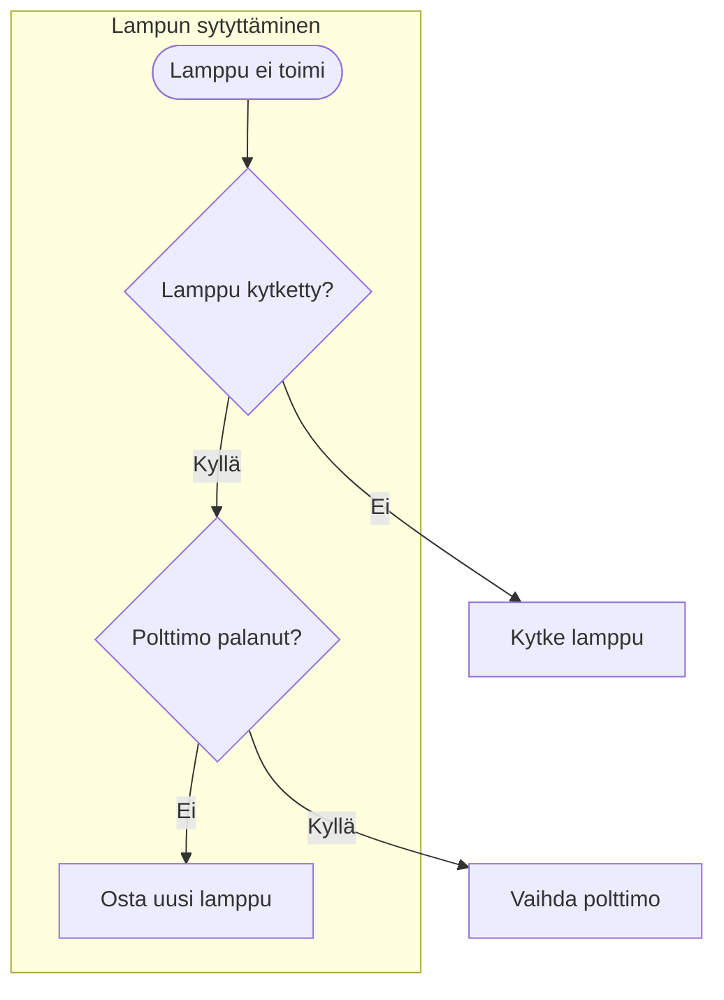
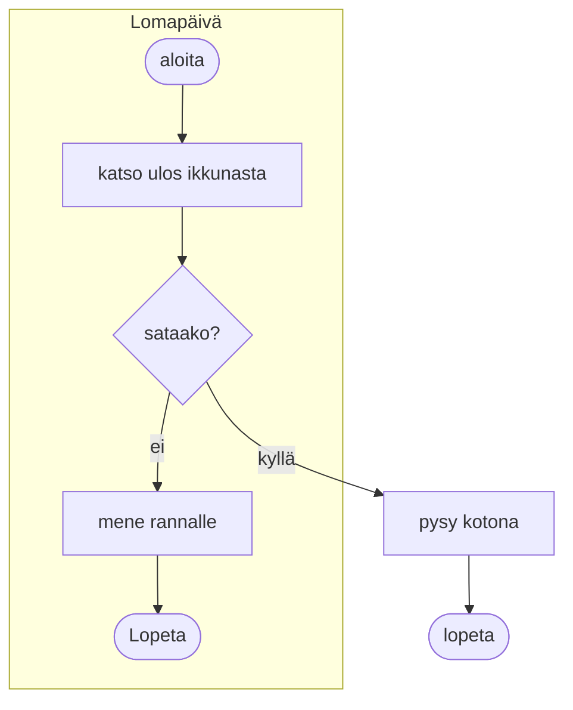
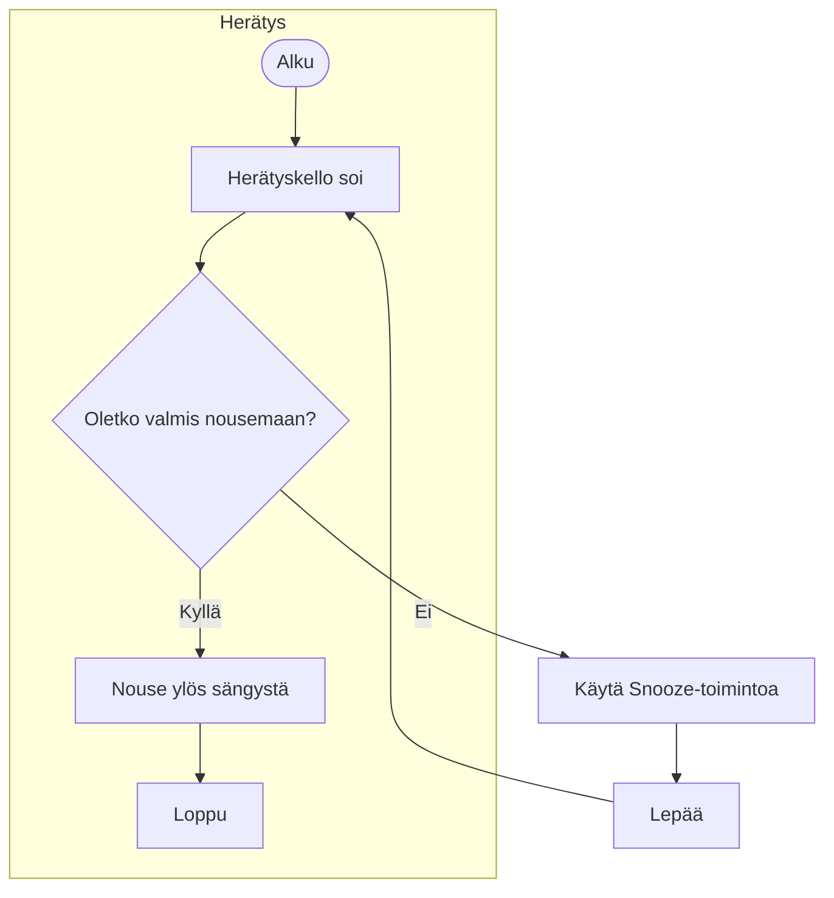
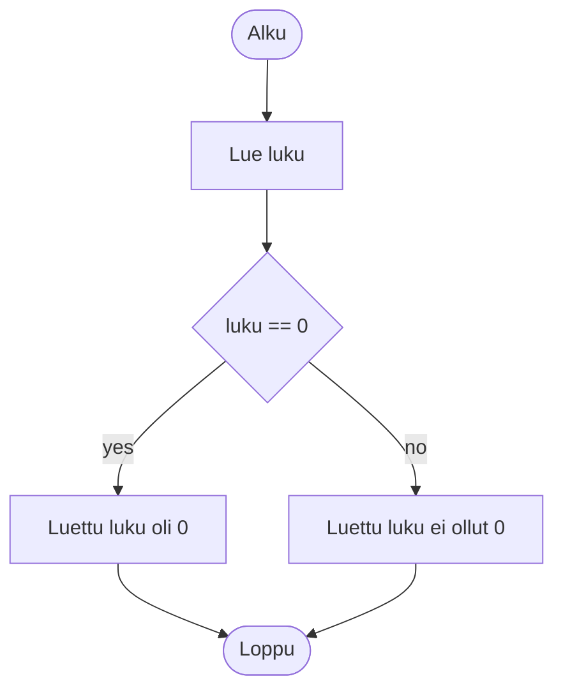
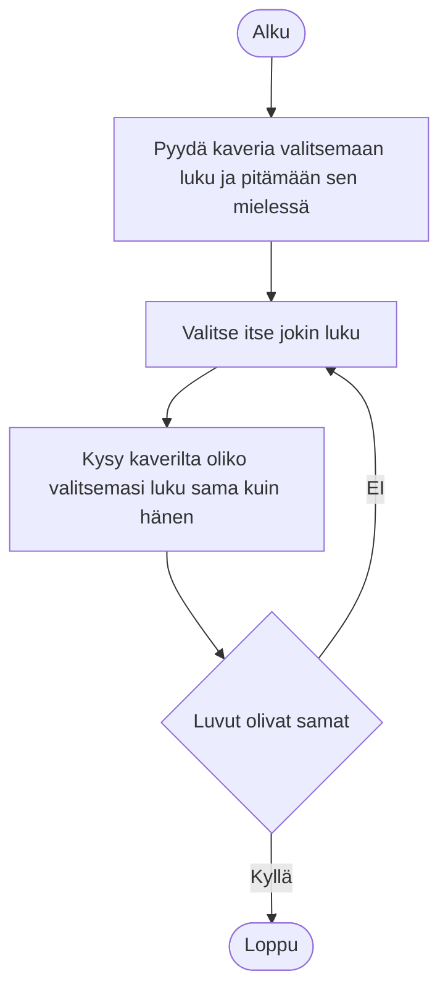

# Vuokaaviot
Tässä on vuokaaviot.

Vessahätä

```mermaid
graph TD;
    A([Aloitus: Kakkahätä!]) --> B([Menet kakalle!])
    B --> C{Onko paperia?}
    C -- Kyllä --> D[Pyyhi!]
    C -- Ei --> E[Käy kaupasta paperia.]
    E --> C
    D --> F[Ole iloinen ja puhdas, vedä pönttö!]
    E --> F
```
---
Lampun sytyttäminen

```mermaid
graph TD;
    subgraph Lampun sytyttäminen
        A([Lamppu ei toimi]) --> B{Lamppu kytketty?}
        B -- Kyllä --> D{Polttimo palanut?}
        D -- Ei --> F[Osta uusi lamppu]
    end
    B -- Ei --> C[Kytke lamppu]
    D -- Kyllä --> E[Vaihda polttimo]
```
---
Lomapäivä

```mermaid
graph TD;
    subgraph Lomapäivä
        A([aloita]) --> B[katso ulos ikkunasta]
        B --> C{sataako?}
        C -- ei --> E[mene rannalle]
        E --> F([Lopeta])
    end
    C -- kyllä --> D[pysy kotona]
    D --> G([lopeta])
```
---
Herätys aamulla

```mermaid
graph TD;
    subgraph Herätys
        A([Alku]) --> B[Herätyskello soi]
        B --> C{Oletko valmis nousemaan?}
        C -- Kyllä --> D[Nouse ylös sängystä]
        D --> E[Loppu]
    end
    C -- Ei --> F[Käytä Snooze-toimintoa]
    F --> G[Lepää]
    G --> B
```
---
Mikä luku

```mermaid
graph TD;
    A([Alku]) --> B[Lue luku]
    B --> C{luku == 0}
    C -- yes --> D["Luettu luku oli 0"]
    C -- no --> E["Luettu luku ei ollut 0"]
    D --> F([Loppu])
    E --> F([Loppu])
```
---
Lukupeli

```mermaid
graph TD;
    A([Alku]) --> B[Pyydä kaveria valitsemaan luku ja pitämään sen mielessä]
    B --> C[Valitse itse jokin luku]
    C --> D[Kysy kaverilta oliko valitsemasi luku sama kuin hänen]
    D --> E{Luvut olivat samat}
    E -- EI --> C[Valitse itse jokin luku]
    E -- Kyllä --> F([Loppu])
```
